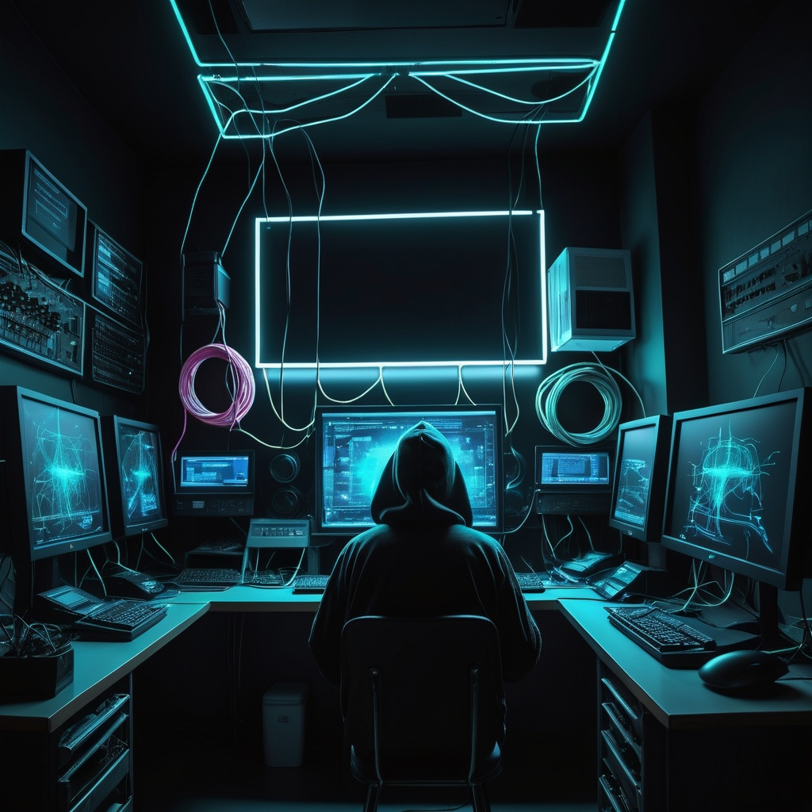
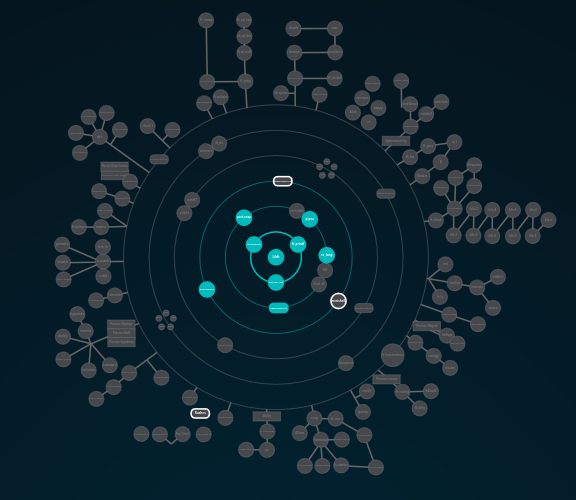

  <em>Images created with AI</em>
    

  # 👋 Hey there! I'm `Dim`

  After spending 10 years managing a restaurant and keeping plates spinning,
  I decided to dive into the tech world at 42 Lausanne.
  Always fascinated by computers and their mysteries -
  I'm turning now that curiosity into learning code.
  A whole new world!
   

  
  

  ### `Last project completed:`

  

  ###### 🤔 [Philosophers](https://github.com/Nesplee/CURSUS/tree/main/philosophers)

  ### `Current working on:`

  

  ###### 🔄 Exam Rank 03
  ###### 🐚 Minishell

