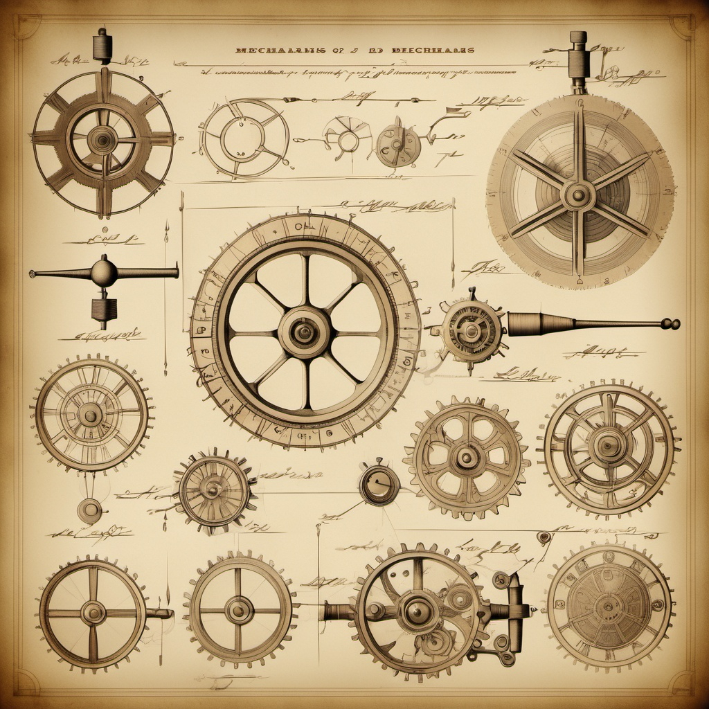

  

  <h1>👋 Hi ! I'm Dim</h1>

  

    After 10 years running a restaurant, I'm now diving into tech at 42 Lausanne. 
    Passionate about computers, I love exploring the world of code and software engineering.
  

  

  <h3>🧠 About Me</h3>

  <ul style="font-size:1.1em; max-width:400px; text-align:left; display:inline-block; line-height:1.7;">
    <li>🍽️ Former restaurant manager, passionate about tech.</li>
    <li>🎓 Student at 42 Lausanne, always eager to learn.</li>
    <li>🎵 Music, movie & sports enthusiast.</li>
    <li>🪙 Interested in blockchain and new technologies.</li>
  </ul>

  

<h3>⛑️ Main Feature</h3>

<ul style="font-size:1.1em; max-width:400px; text-align:left; display:inline-block; line-height:1.7;">
  <li>🔗 Discover my full journey here: <a href="https://github.com/Nesplee/CURSUS">CURSUS</a></li>
</ul>

### ⚙️ Last projects completed
<table>
  <tr style="vertical-align: top;">
    <td width="40%" align="center">
      
    </td>
    <td>
      <h4>⭐ <a href="https://github.com/Nesplee/CPP#readme">CPP04</a></h4>
      C++ module, object-oriented programming, polymorphism, inheritance..
      <h4>⭐ <a href="https://github.com/Nesplee/CUB3D#readme">CUB3D</a></h4>
      3D graphics project, raycasting & event handling
    </td>
  </tr>
</table>

### 🛠️ Currently working on
  <table>
    <tr style="vertical-align: top;">
      <td width="40%" align="center">
        
      </td>
      <td>
      <h4>🌐 <a href="https://github.com/Nesplee/WEBSERV#readme">Webserv</a></h4>
      Building on an implementation of a web server in C++ with my man <a href="https://github.com/isaiahrbs">@isaiahrbs</a>
      <h4>⭐ Exam Rank 05</h4>
      Preparing the next 42 exam
    </td>
  </tr>
</table>

### 💻 My first program
  <table>
    <tr style="vertical-align: top;">
      <td width="40%" align="center">
        
      </td>
      <td>
        <h4><a href="https://github.com/Nesplee/CRYPTO">ASSET MANAGER</a></h4>
        
During my first month at 42 School, I developed this program as preparation for my initial exam. A portfolio management system that helped me strengthen core programming concepts like memory management, complex data structures, and header file organization.

      </td>
    </tr>
  </table>

  ### 📊 Github stats

  

  ### 📫 Get in Touch

  

  

    

  

