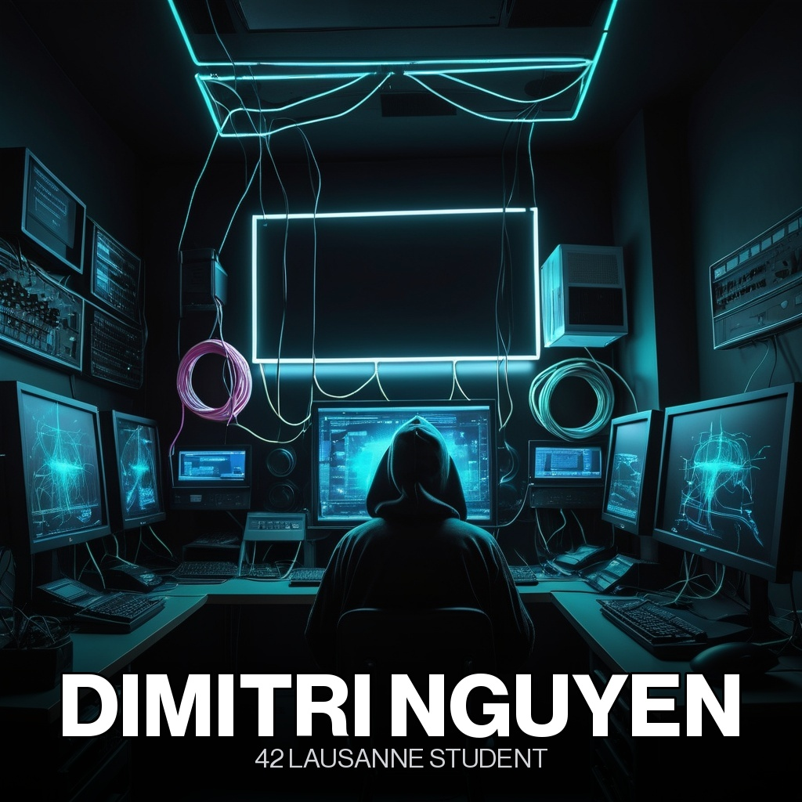
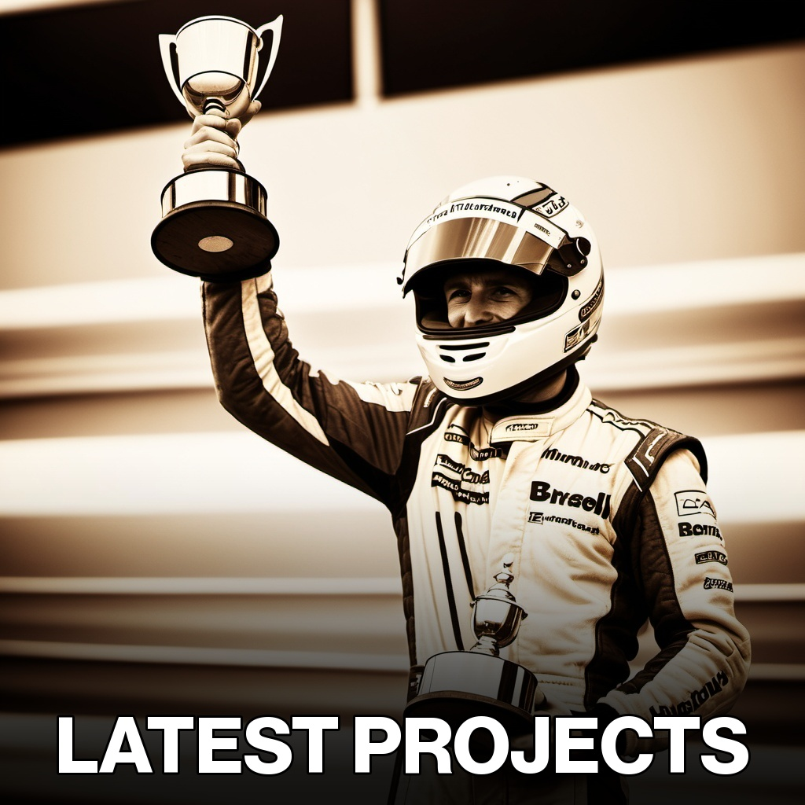
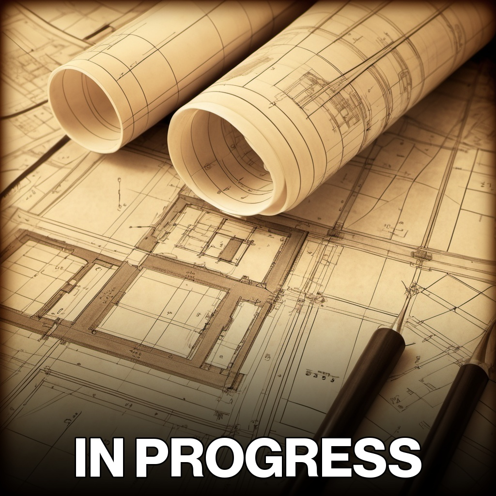
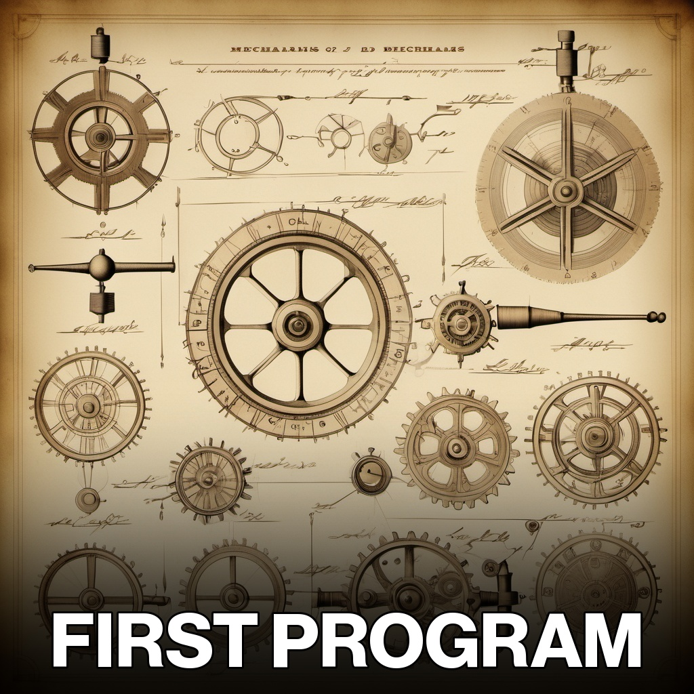

<div align="center">

  

</div>

```
$ whoami
> Dimitri Nguyen — 42 Lausanne · ex-restaurant manager turned developer
> status: building. always.
```

<div align="center">

<a href="https://42lausanne.ch"></a>
<a href="https://www.linkedin.com/in/dimitri-nguyen"></a>
<a href="https://discord.com/users/801831696441278494"></a>
<a href="https://t.me/nesplee"></a>

</div>


### 🧠 About Me

<table width="100%">
<tr><td width="20%"><b>Role</b></td><td>Software developer in training, 42 Lausanne Common Core</td></tr>
<tr><td><b>Background</b></td><td>10 years running a restaurant before switching to tech</td></tr>
<tr><td><b>Focus</b></td><td>Systems programming, low-level C/C++, now moving into web &amp; infra</td></tr>
<tr><td><b>Also into</b></td><td>Music, movies, sports, blockchain and new tech</td></tr>
</table>


### ⛑️ Main Feature

<p align="center">🔗 Discover my full journey here: <a href="https://github.com/Nesplee/CURSUS"><b>CURSUS</b></a></p>


### ⚙️ Last projects completed
<table>
  <tr style="vertical-align: top;">
    <td width="40%" align="center">
      
    </td>
    <td>
      <h4 align="center">🐳 <a href="https://github.com/Nesplee/INCEPTION#readme">INCEPTION</a></h4>
      <p align="center">Multi-service Docker infrastructure: NGINX with TLS, WordPress, MariaDB, plus FTP, Redis, and n8n as bonus services.</p>
      <h4 align="center">🌐 <a href="https://github.com/Nesplee/WEBSERV#readme">WEBSERV</a></h4>
      <p align="center">Non-blocking HTTP/1.1 server in C++98, built with my man <a href="https://github.com/isaiahrbs">@isaiahrbs</a></p>
    </td>
  </tr>
</table>


### 🛠️ Currently working on
  <table>
    <tr style="vertical-align: top;">
      <td width="40%" align="center">
        
      </td>
      <td>
      <h4 align="center">🎓 FT_TRANSCENDENCE</h4>
      <p align="center">The final Common Core project: a full-stack web app, my last stretch before graduating the 42 Common Core.</p>
    </td>
  </tr>
</table>


### 💻 My first program
  <table>
    <tr style="vertical-align: top;">
      <td width="40%" align="center">
        
      </td>
      <td>
        <h4 align="center"><a href="https://github.com/Nesplee/CRYPTO">ASSET MANAGER</a></h4>
        <p align="center">During my first month at 42 School, I developed this program as preparation for my initial exam. A portfolio management system that helped me strengthen core programming concepts like memory management, complex data structures, and header file organization.</p>
      </td>
    </tr>
  </table>


<div align="center">

### 📫 Get in Touch

<p>
<a href="https://discord.com/users/801831696441278494"></a>
<a href="https://www.linkedin.com/in/dimitri-nguyen"></a>
<a href="https://t.me/nesplee"></a>
</p>

</div>
