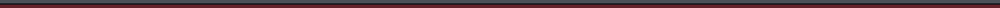

<div align="center">

  

</div>

```
$ whoami
> Dimitri Nguyen — 42 Lausanne · ex-restaurant manager turned developer
> status: building. always.
```

<div align="center">

<p>
<a href="https://42lausanne.ch"></a>
</p>

</div>



<h3 align="center">🧠 About Me</h3>

<div align="center">
<table width="600">
<tr><td width="30%" align="center"><b>Role</b></td><td align="center">Software developer in training, 42 Lausanne Common Core</td></tr>
<tr><td align="center"><b>Background</b></td><td align="center">10 years running a restaurant before switching to tech</td></tr>
<tr><td align="center"><b>Focus</b></td><td align="center">Systems programming, low-level C/C++, now moving into web &amp; infra</td></tr>
<tr><td align="center"><b>Also into</b></td><td align="center">Music, movies, sports, blockchain and new tech</td></tr>
</table>
</div>


<h3 align="center">⛑️ Main Feature</h3>

<p align="center">🔗 Discover my full journey here: <a href="https://github.com/Nesplee/CURSUS"><b>CURSUS</b></a></p>


<h3 align="center">⚙️ Last projects completed</h3>
<table>
  <tr style="vertical-align: top;">
    <td width="40%" align="center">
      
    </td>
    <td>
      <h4 align="center">🐳 <a href="https://github.com/Nesplee/INCEPTION#readme">INCEPTION</a></h4>
      <p align="center">Multi-service Docker infrastructure: NGINX with TLS, WordPress, MariaDB, plus FTP, Redis, and n8n as bonus services.</p>
      <h4 align="center">🌐 <a href="https://github.com/Nesplee/WEBSERV#readme">WEBSERV</a></h4>
      <p align="center">Non-blocking HTTP/1.1 server in C++98, built with my man <a href="https://github.com/isaiahrbs">@isaiahrbs</a></p>
    </td>
  </tr>
</table>


<h3 align="center">🛠️ Currently working on</h3>
  <table>
    <tr style="vertical-align: top;">
      <td width="40%" align="center">
        
      </td>
      <td>
      <h4 align="center">🎓 FT_TRANSCENDENCE</h4>
      <p align="center">The final Common Core project: a full-stack web app, my last stretch before graduating the 42 Common Core.</p>
    </td>
  </tr>
</table>


<h3 align="center">🚀 Latest services</h3>
  <table>
    <tr style="vertical-align: top;">
      <td width="40%" align="center">
        
      </td>
      <td>
        <h4 align="center">🃏 <a href="https://github.com/Nesplee/card-price-tracker">CARDTRACKER</a></h4>
        <p align="center">A price tracking tool for trading cards, built to monitor market value fluctuations across sources.</p>
        <h4 align="center">📢 <a href="https://github.com/Nesplee/Daily-Jobs-Offers">ANNONCES</a></h4>
        <p align="center">A job listings aggregator that collects and surfaces daily job offers.</p>
      </td>
    </tr>
  </table>


<div align="center">

<h3 align="center">📫 Get in Touch</h3>

<p>
<a href="https://discord.com/users/801831696441278494"></a>
<a href="https://www.linkedin.com/in/dimitri-nguyen"></a>
<a href="https://t.me/nesplee"></a>
</p>

</div>
